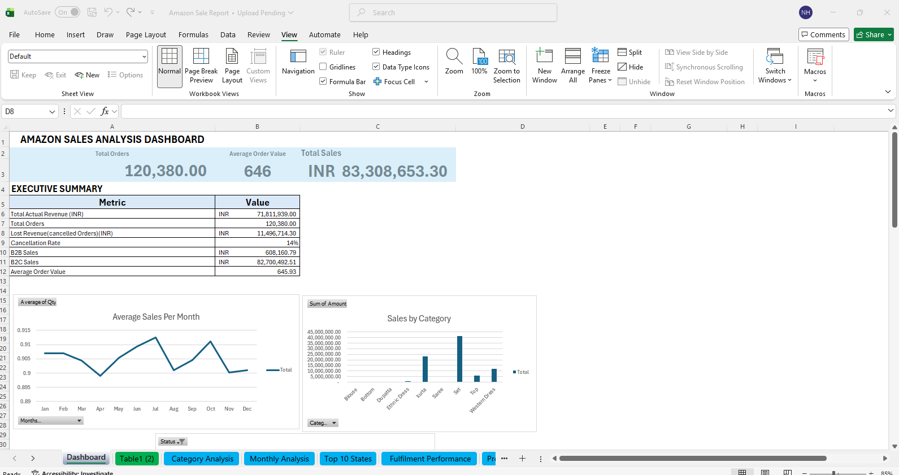

# Amazon Sales Analysis Dashboard

## 📊 Project Overview
Interactive Excel dashboard analyzing **128,975 Amazon sales transactions** across 11 months (January - December 2022) to identify revenue optimization opportunities for an e-commerce fashion business.

**💰 Total Revenue Analyzed:** ₹83.3 Million INR  
**📍 Geographic Coverage:** 71 states/regions across India  
**📦 Product Categories:** 10 categories analyzed

---

## 🎯 Key Business Insights

### 1️⃣ Fulfillment Optimization Opportunity
**Amazon fulfillment reduces cancellations by 27%** compared to Merchant fulfillment
- Amazon fulfillment: **12.79%** cancellation rate
- Merchant fulfillment: **17.47%** cancellation rate
- **Potential annual savings: ₹1.2M**

### 2️⃣ Product Concentration Risk
**'Set' category dominates with 49% of total revenue** (₹41.2M)
- Creates business risk if demand drops
- Opportunity to diversify product portfolio
- Ethnic Dress category only represents 1% of revenue

### 3️⃣ Geographic Concentration Opportunity
**Top 10 states drive majority of revenue**
- 10 states generate 78.5% of total revenue (₹56.4M)
- Maharashtra leads with ₹12.2M, followed by Karnataka (₹9.7M) and Telangana (₹6.3M)
- **Opportunity:** 15% growth in these proven markets = ₹8.5M additional revenue

---

## 📈 Dashboard Preview

### Main Dashboard

### Fulfillment Performance Analysis

### Data Cleaning Documentation

---

## 📂 Project Structure

### Excel Workbook: `Amazon_Sale_Report.xlsx`

**11 Sheets organized as:**

1. **Dashboard** - Executive summary with interactive KPIs
2. **Table1 (2)** - Cleaned dataset (128,975 records) - primary data source
3. **Category Analysis** - Revenue breakdown by product category
4. **Monthly Analysis** - Seasonal trends and quantity patterns
5. **Top 10 States** - Geographic performance analysis
6. **Fulfilment Performance** - Amazon vs Merchant comparison
7. **Product Analysis** - Top-performing SKUs
8. **Size Analysis** - Sales by product size
9. **Amazon Sale Report** - Original raw dataset (before cleaning)
10. **Data_Cleaning_Log** - Documentation of 7 cleaning steps
11. **README** - Complete project documentation

### Data Flow

Raw Data → Cleaning Process → Cleaned Data → Analysis → Dashboard
↓
Data_Cleaning_Log

---

## 🛠️ Technical Skills Demonstrated

### Data Cleaning & Preparation
- Standardized **3 different date formats** using Power Query
- Handled **49,153 missing values** with appropriate fill strategies
- Validated data integrity across 128K+ records
- Created derived fields for analysis (Cleaned_Date)

### Analysis & Visualization
- Built **6 specialized analysis views** (Category, Monthly, Geographic, Fulfillment, Product, Size)
- Designed interactive dashboard with **live KPIs**
- Performed segmentation and comparative analysis
- Identified trends and patterns across 11-month period

### Business Intelligence
- Translated data insights into **3 actionable recommendations**
- Quantified business impact (₹1.2M savings opportunity)
- Prioritized recommendations by implementation timeline
- Documented complete analysis workflow

---

## 💼 Business Recommendations

### 🔴 Immediate Action (High Impact)
**Prioritize Amazon fulfillment** for high-value products to reduce cancellation losses
- Expected impact: ₹1.2M annual savings

### 🟡 Short-Term (3-6 months)
**Increase marketing in top 10 performing states**
- Maharashtra, Karnataka, Telangana, UP, Tamil Nadu, Delhi, Kerala, West Bengal, Andhra Pradesh, Haryana
- These states represent 78.5% of total revenue (₹56.4M)

### 🟢 Long-Term (6-12 months)
**Diversify product portfolio** to reduce dependency on 'Set' category
- Invest in marketing for underperforming categories
- Expand Western Dress and Ethnic Dress lines

---

## 🔧 Tools & Technologies

- **Microsoft Excel** - Pivot Tables, Charts, Conditional Formatting, Formulas
- **Power Query** - Data transformation and standardization
- **Data Analysis** - Segmentation, trend analysis, performance metrics

---

## 📊 Dataset Details

- **Time Period:** January 4, 2022 - December 6, 2022
- **Total Transactions:** 128,975
- **Unique Orders:** 120,378
- **Total Revenue:** ₹83,308,653.30
- **Product Categories:** 10
- **Geographic Coverage:** 71 states/regions
- **Fulfillment Methods:** 2 (Amazon, Merchant)

---

## 📥 How to Use This Project

1. **Download** the Excel file: `Amazon_Sale_Report.xlsx`
2. **Start with** the Dashboard sheet for executive summary
3. **Explore** individual analysis sheets for detailed insights
4. **Review** Data_Cleaning_Log to understand data preparation
5. **Check** README sheet inside Excel for complete documentation

---

## 👤 About This Project

Created as part of the **5-Week Friday Data Portfolio Challenge** to demonstrate job-ready data analysis skills for roles in Greater Manchester and South Yorkshire.

This project showcases end-to-end data analysis capabilities:
- Data cleaning and quality assurance
- Exploratory data analysis
- Business intelligence dashboard design
- Data-driven decision making
- Professional documentation

---

## 📧 Contact

**Norhan Koshty**  
📍 Location: [Doncaster / South Yorkshire]  
📧 Email: norhan.hamed094@gmail.com
💼 LinkedIn: www.linkedin.com/in/norhan-koshty-52b2b72a0

---

## 📜 License

This project is available for portfolio and educational purposes.

---

⭐ **If you found this project helpful, please give it a star!**
